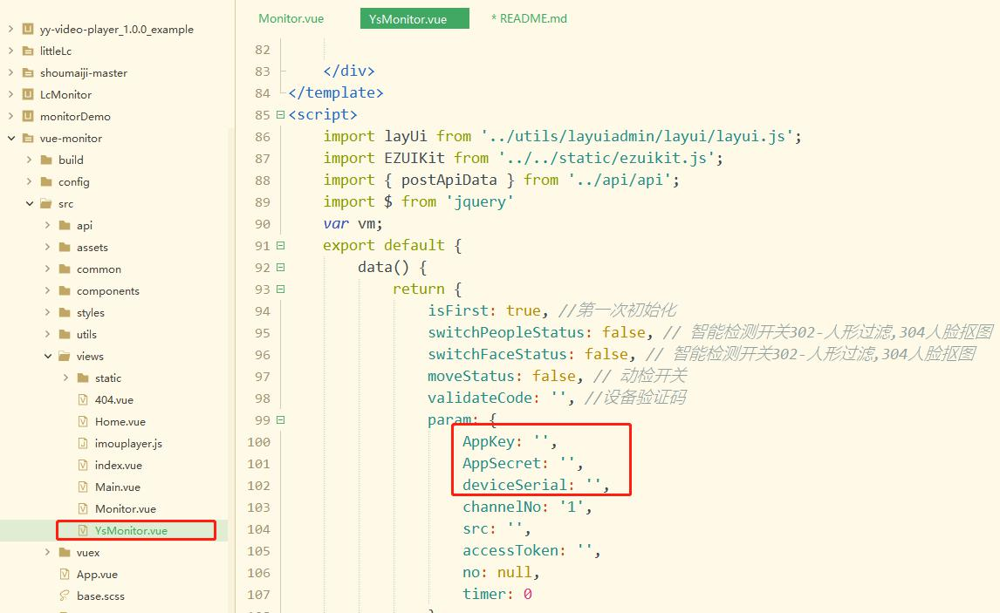
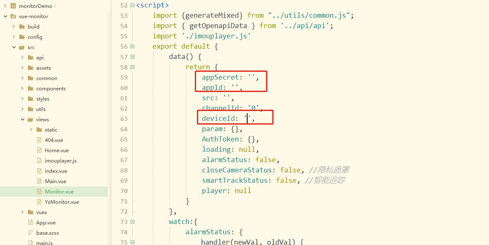

# To start

This is a project template for [vue-cli](https://github.com/vuejs/vue-cli)

``` bash
# install dependencies
npm install

# serve with hot reload at localhost:8081
npm run dev

# build for production with minification
npm run build

```

# Folder structure
* build - webpack config files
* config - webpack config files
* dist - build
* src -your app
    * Monitor.vue
    * YsMonitor.vue
    * App.vue
    * main.js - main file
    * routes.js
* static - static assets
* 以下2个地方填写大华乐橙和海康萤石设备信息
* 
* 

# Browser support

Modern browsers and IE 10+.

# License
[MIT](http://opensource.org/licenses/MIT)
